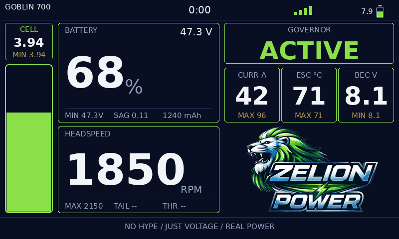
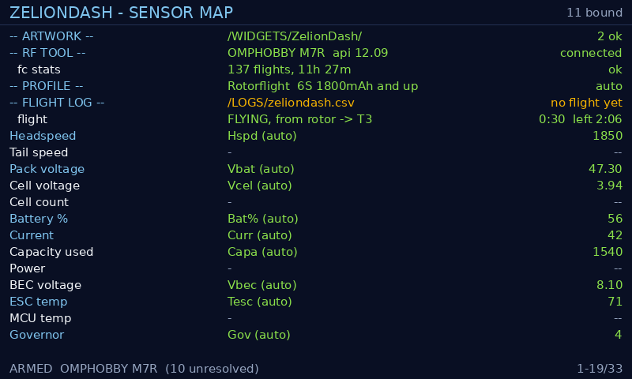

# ZelionDash

An RC helicopter telemetry dashboard widget for EdgeTX, targeting Rotorflight
electric setups on the RadioMaster TX16S Mk3 and TX15.

**Status: flying.** Verified on a TX16S Mk3 and a TX15, across a 200-size
OMPHOBBY on 2S/3S and a Rotorflight M7R on 12S: sensor binding, arming from
ARM flags, a switch and the rotor, alerts firing in the air, the flight log,
the aircraft profile, and RF Tool reading the flight controller's own totals.



More screens, including the TX15, are in [docs/screens.md](docs/screens.md).

## Requirements

- EdgeTX 2.11 or newer
- A full-screen widget slot

Target screen sizes:

| Size | Radio | Density class |
|---|---|---|
| 800×480 | RadioMaster TX16S Mk3 | roomy |
| 480×320 | RadioMaster TX15 | tight |
| 480×272 | other colour radios | tight |

The two primary targets are different shapes, not one layout scaled: width
differs by a factor of 0.60 but height by 0.67, and the smaller screen has
about 40% of the drawing area. Panels therefore *rearrange* between density
classes rather than shrinking uniformly — text cannot scale continuously,
since EdgeTX offers only a handful of fixed font sizes.

Layout adapts to whatever `LCD_W`/`LCD_H` the radio reports, so an untested
size still lands in the nearest sensible density class.

## Installing

Copy the built widget onto the radio's storage:

```
/WIDGETS/ZelionDash/main.lua
```

The file to copy is `dist/WIDGETS/ZelionDash/main.lua`. Then add ZelionDash to
a full-screen widget slot on the radio.

### Updating: delete the .luac

**When you replace `main.lua` with a newer one, delete `main.luac` from the
same folder.**

EdgeTX compiles a script to bytecode on first run and caches it beside the
source. On every later load it compares the two timestamps and runs the
`.luac` unless the `.lua` is strictly newer
(`luaLoadScriptFileToState`, radio/src/lua/interface.cpp). A file copied over
USB carries whatever timestamp the copy gave it, and the radio's clock and the
computer's rarely agree — so a genuinely newer script can easily look older
than the bytecode the radio built from its predecessor, and the update
silently does nothing. The widget keeps running the old code, with the old
bugs, and nothing anywhere says why.

Deleting the `.luac` removes the choice. The radio recompiles on the next
boot, which costs about a second, once.

## What it shows

A single screen, no modes. Battery state and headspeed carry the two hero
tiles; cell voltage sits above the fuel gauge on the left; governor, current,
ESC temperature and BEC sit right of centre. The critical values are pinned
left, on the assumption you fly off a neck strap and glance down-left.

There is one screen and it is built once. A separate splash used to stand in
before the pack was plugged in, on the reasoning that a grid of dashes looks
broken — but the dashboard already tells "no sensor" apart from "reading zero",
and the real layout says more: you can see the widget is alive, laid out, and
waiting on named values. Removing it also removed the only screen-to-screen
transition, which is where an emergency-mode reboot used to live.

A mid-flight telemetry dropout blanks the live value but keeps the session
peak — blanking everything at exactly the wrong moment would be worse than
showing a reading that has stopped moving.

## Aircraft profile

The **Profile** option in the widget settings says what class of helicopter
this is:

| Value | Profile | For |
|---|---|---|
| `0` | Auto *(default)* | works it out from pack voltage |
| `1` | Rotorflight | 6S 1800 mAh and up |
| `2` | OMPHOBBY OSF03 | 200-size, 2S–3S |

It's a number rather than a name because EdgeTX widget options have no list
type. The resolved name is shown on the sensor map instead, along with whether
it was set or detected.

Telemetry can tell the dashboard that the current is 300 A. It cannot tell it
whether that is a Tuesday or a bad frame — that depends entirely on the
aircraft. So a profile carries only the things the widget genuinely cannot
detect and that change what it does:

- **What readings are plausible**, so a corrupt frame is rejected instead of
  becoming a session peak and going into the flight log.
- **What headspeed counts as flying.** A 700 idles well below 250 rpm; a
  200-size flies at around 5000, so 250 rpm there is still spooling up.
- **The ESC temperature alert.** 110 °C on a big ESC, 90 °C on a small one in
  a tight canopy.

Cell voltage is deliberately *not* in there: a LiPo cell is in trouble at
3.40 V whether it is one of two or one of fourteen.

**Auto** goes on pack voltage — 6S is 18 V flat and 3S is 12.6 V full, so
nothing lands in the gap. It watches for three seconds and decides on the
*highest* reading seen, because a pack coming up can read too low but never too
high. It then holds, so a pack sagging across the boundary can't reclassify the
aircraft mid-flight, and it re-decides when you change model.

**It also notices when it got it wrong.** A profile that keeps rejecting
readings the role itself accepts is a wrong profile, so after two seconds of
that it drops the decision and detects again. The sensor map then shows `auto*`
rather than `auto`, because a stretch of readings that went missing deserves an
explanation.

That path exists because it happened: a 12S M7R came up reading low for a
moment, latched as a 200-size, and spent the flight rejecting its own pack
voltage and capacity as out of range — the windows doing exactly their job,
aimed at the wrong aircraft.

Note the split is really by size and pack rather than by firmware — Rotorflight
runs 200-size helis too. A Rotorflight 200 wants profile `2`, and Auto picks
that correctly.

Anything you set in `sensors.cfg` beats the profile.

## Sensor diagnostics



Turn on **Show Sensor Map** in the widget settings. It lists every telemetry **role** the dashboard knows
about, which sensor on your model got bound to it, and how that binding
happened:

| Column | Meaning |
|---|---|
| Role | What the dashboard needs (Headspeed, ESC temp, …) |
| Sensor | Which of your telemetry sensors filled it |
| `cfg` | You named it explicitly in `sensors.cfg` |
| `auto` | Matched a known sensor name |
| `guess` | Inferred from the sensor's unit — **worth checking** |
| `off` | You switched it off in `sensors.cfg` |
| Value | Live reading, or why there isn't one |

Roles the dashboard considers important are shown in bold, and turn amber when
unbound. Use the scroll wheel to page through the list on the smaller screen.

This is the first place to look when a panel reads `--`.

A `guess` that picked the wrong sensor is corrected in `sensors.cfg`, either by
naming the right one or with `role = off` when there is no right one. Naming a
sensor the radio does not have will not do it — an unknown name falls through
to the same guess.

## Alerts

**Audio + Vibe Alerts** is on by default. Four conditions fire:

| | Fires at | Clears at | Says |
|---|---|---|---|
| Cell voltage | 3.40 V | 3.50 V | speaks the reading |
| ESC temperature | 110 °C | 102 °C | speaks the reading |
| Governor fault | THR-OFF, LOST-HS, AUTOROT | recovery | buzz only |
| Link | lost, or quality 30 | 45 | buzz only |

Readings are spoken through the radio's own number vocabulary, so there is no
sound file to install and you hear them in whatever language the radio is set
to. A sounding alert also names itself in the bottom strip, since the radio
may be muted.

Alerts clear at a different value from the one that triggers them, repeat on a
timer rather than on every frame, and stay silent for the first four seconds
of telemetry. Those three rules are what stop a cell sagging across the line
under load from alarming on every rotor beat.

They sound while another screen is in front, and the **Hold Switch** silences
them.

**Test Alert** sounds one on demand — that is the pre-flight check that the
volume is up and the haptic is on. It speaks the live cell voltage, so it also
confirms the right sensor is bound.

Thresholds are configurable; see `docs/sensors.cfg.example`.

## Time remaining

Set **Time Timer** in the widget settings to 1, 2 or 3 and ZelionDash drives
that EdgeTX timer with the predicted seconds of flight left. 0 is off.

Only the timer's *running value* is written. Its name, countdown voice, minute
calls and haptic stay yours, configured on the timer page — so the radio
announces the countdown in your own language, with your cadence, and the number
shows up on the header bar and every telemetry screen rather than only here.

Voltage is a late signal on an electric heli: sag under load dominates, so the
cell alert fires when you are already most of the way through the pack.
Consumed capacity is the early, linear one.

**It does not need to know your pack size.** Capacity used is a real number of
mAh and battery percent is the fraction still in there, so the remainder
follows from the two — 580 mAh gone with 42% showing implies 420 mAh left. That
matters when the same radio flies a 400 mAh 2S and a 12S 700: a pack size
configured once is a pack size that is wrong next time you change battery.

**Pick a timer you are not already using.** Only the running value is written,
so the timer's own settings survive — but the number becomes this estimate, and
a timer you had counting down from 5:00 stops being that timer. The sensor map's
`flight` row shows which one is being driven (`FLYING, from telemetry -> T3`),
so a wrong choice is visible on the ground rather than in the air.

The estimate reaches zero at a reserve rather than at a flat pack. Default 20%;
change it with `reservePct` in `sensors.cfg`.

It refuses to answer rather than guess — in the first seconds of a flight,
off a pack too full for the arithmetic to mean anything, or with no capacity or
percent sensor. The `flight` row on the sensor map says which. It also only
ever falls: an estimate that climbs while you fly reads as broken, and EdgeTX
announces a countdown by watching thresholds, so a value drifting back up over
60 would say "one minute" twice.

## Flight log

**Log Flights** is on by default. One CSV line per flight, written once, when
the flight ends:

```
date,time,model,seconds,max_rpm,min_cell,min_pack,max_amps,max_esc_c,used_mah,end_pct,start_pack,start_cell,avg_amps,min_lq
2026-08-05,14:14:09,GOBLIN 700,245,1850,3.58,44.10,88.0,71,1240,22,50.20,4.18,44.6,88
```

The last four are collected rather than displayed. `start_pack` and
`start_cell` are the **resting** voltages, sampled while disarmed and frozen at
arm — not read at the moment of arming, because with rotor-based arming the
head is already turning by then and a voltage under load is the one thing
they'd be useless as. Together with `avg_amps` they are what a pack-health
trend would eventually be built from; `min_lq` is the worst link quality of the
flight, which is otherwise thrown away every time you land.

Nothing reads them yet. They are here because they cannot be recovered
afterwards: a flight flown before the column existed is a row that will always
be blank, and a trend needs flights behind it before it is worth building on.

Columns are only ever appended, never reordered or removed, and a log written
by an earlier build is widened in place rather than abandoned.

It lands at **`/LOGS/zeliondash.csv`**, next to EdgeTX's own telemetry logs,
opens in any spreadsheet, and keeps the most recent 200 flights. That location
survives reinstalling the widget, which the widget's own folder does not.

If `/LOGS/` cannot be written it falls back to the widget folder rather than
losing the flight. Either way the sensor map's `-- FLIGHT LOG --` line shows
the path actually in use.

Note that "SD card" is the wrong word for any of this: EdgeTX presents one path
namespace whether the radio's storage is a card or internal flash, and a Lua
script cannot tell the difference. To get the file off, put the radio into USB
storage mode, or browse to it on the radio itself. A missing reading is left blank rather than
written as zero, because a column of zeroes that were really "no sensor"
averages into a lie.

Anything under 20 seconds is not logged — that is a spool-up test, not a
flight.

### If a switch is round the wrong way

EdgeTX reports a two-position switch as `-1024` and `+1024`, and nothing in the
value says which end you call "armed" — that depends on how the switch is
mounted. The widget assumes the positive end. If yours is the other way round,
turn on **Arm Invert** (or **Hold Invert**) in the widget settings.

Both are worth getting right, and both fail silently:

- A reversed **arm** switch reads as armed whenever you think it's off. It runs
  the flight timer on the bench, and logs a "flight" the moment you switch off.
- A reversed **hold** switch silences the alerts and freezes the peaks for the
  entire flight, while looking exactly like a working one.

The sensor map shows `arm source switch (inv)` when the arm switch is
inverted, so the two cases don't look identical.

A flight starts and ends from the flight controller's ARM flags where they
exist. Where they do not, ZelionDash falls back to the **Arm Switch** option
if you have set one, and failing that to the rotor itself: above 250 rpm is a
flight, and it ends five seconds after the head drops below 100. That last
fallback is what makes the log, the flight timer and the session peaks work on
a non-Rotorflight stack.

## Rotorflight RF Tool integration (optional)

If Rotorflight's **RF Tool** widget is installed, ZelionDash uses it for two
things telemetry alone cannot provide:

- **Flight count and total airtime from the flight controller itself**, rather
  than a counter kept on the radio's storage. The FC's numbers match what
  Configurator reports and don't diverge when you fly the same heli with a
  second radio. Requires MSP API 12.9 or newer.
- **Authoritative connection state.** Without RF Tool the dashboard can only
  infer whether the link is up; RF Tool actually knows.

This is entirely optional — with RF Tool absent the dashboard is fully
functional and says nothing about it. Flight controller data is requested only
when the link connects and after each landing, never per frame, so it costs
almost no telemetry bandwidth.

## Configuring sensor names

Sensor discovery is automatic and usually needs no configuration. If your model
publishes a sensor under an unusual name, override it in:

```
/WIDGETS/ZelionDash/sensors.cfg
```

```ini
# Applies to all models
[*]
escTemperature = Tesc

# Just this model, matched against the model name in EdgeTX
[Goblin 700]
escTemperature = Tmp1
headspeed      = MyRPM
```

A model's own section wins over `[*]`. Section names are case-insensitive.
Unknown role names are reported at the bottom of the diagnostics screen rather
than silently ignored, so a typo is visible. See `docs/sensors.cfg.example` for
the full list of role names.

A missing config file is entirely normal — everything auto-detects.

## Development

Requires Lua 5.4 on the desktop (`apt install lua5.4`).

```sh
lua5.4 tools/build.lua    # src/*.lua  ->  dist/WIDGETS/ZelionDash/main.lua
lua5.4 tests/run.lua      # run the test suite
tools/make_screens.sh     # redraw docs/screens/*.png from the code
```

The screenshots are generated, not photographed: `tools/dump_screen.lua` builds
a real screen through the widget's own layout against the LVGL mock and dumps
every object, and `tools/render_screen.py` draws that dump at true resolution
with EdgeTX's own font line heights. Rerun it after any layout change, or the
pictures in this README start lying. Needs `python3` with Pillow.

### Layout

```
src/       widget sources, one file per layer
tools/     build script, desktop EdgeTX mock, module loader
tests/     test suite (runs against both src/ and the built artifact)
dist/      the deployable widget - copy this to the radio
docs/      a ready-to-install sensors.cfg, and the full reference
```

`src/` is modular for development; `tools/build.lua` concatenates it into a
single `main.lua` for the radio, because EdgeTX's multi-file loading is fiddly
enough that every widget of this size ships as one file.

### Architecture

Seven layers, each talking only to its neighbours:

1. **Host adapter** (`host.lua`) — the only code that touches EdgeTX directly.
   Absorbs firmware differences, and lets everything above it run on a desktop
   against `tools/mock_edgetx.lua`.
2. **Sensor resolver** (`roles.lua`, `config.lua`, `sensors.lua`) — binds
   abstract roles to whatever sensors this model actually has.
3. **State model** (`state.lua`) — current values, session extremes, validity,
   arm detection, flight timing.
4. **Alert engine** (`alerts.lua`) — decides when a condition is worth
   interrupting the pilot for. Hysteresis, repeat timers and a settle window,
   because the only way an alert system fails in practice is by becoming noise.
5. **Layout engine** (`layout.lua`, `theme.lua`) — screen geometry as pure
   arithmetic. Two density classes rather than one scaled layout, because the
   targets are different shapes and EdgeTX fonts do not scale continuously.
6. **Renderer** (`dashboard.lua`) — retained-mode LVGL. Objects are created
   once; each frame writes only the properties whose values changed.
7. **Persistence** (`flightlog.lua`) — one CSV line per flight, written once at
   landing. Flight count also comes from the flight controller when RF Tool is
   available.

Two rules run through all of it:

- **A missing sensor and a sensor reading zero must never look the same.**
  Every value carries a validity flag, and readings outside a plausible range
  are rejected rather than displayed.
- **Fail loud, not silent.** An unresolvable sensor, a bad config line, or a
  failed write is shown on screen rather than swallowed. Harder than it sounds:
  three separate silent failures cost one flight record between them, and each
  only became visible once the previous was fixed.

## See also

**[ZelionPerf](https://github.com/gcholdingscorporation/zelionperf)** — a
frame-rate analyser for the EdgeTX UI, which began here and now lives in its
own repository. If this dashboard, or any other widget, is costing you frames,
that is the tool that will tell you so and measure what removing it buys.

## Credits

Design informed by two excellent existing dashboards: the KRC Dashboard
(Ben Ke and Thanh Tieu, adapted by Bert Krammer) and StacyDash (Kyle Stacy).
No code from either is used here.
