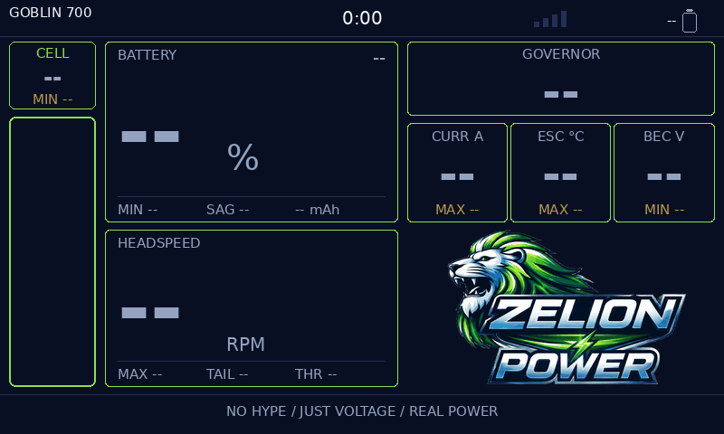
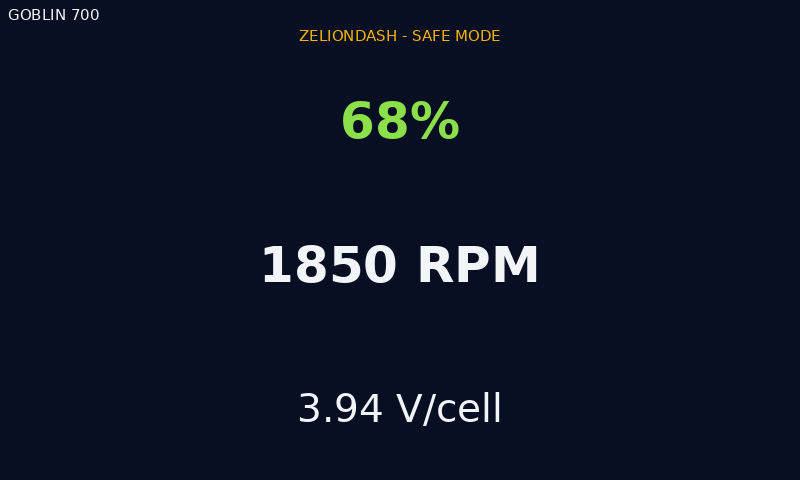
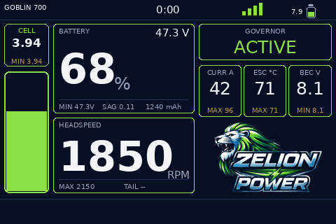
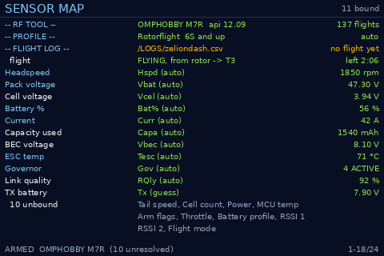

# Screens

Every image here is **rendered from the code**, not drawn by hand and not
photographed off a radio. `tools/dump_screen.lua` builds a real screen through
the widget's own layout against a recording LVGL mock and dumps every object it
produced; `tools/render_screen.py` draws that dump at true resolution using
EdgeTX's own font line heights and the real artwork.

That distinction is the whole point. A mock-up drifts from the code and then
lies about it — an earlier hand-drawn preview did exactly that, using a 9pt
"small" where EdgeTX's is 23px on a TX16S, which is how every panel ended up
with its header printed inside its own value. These cannot drift: regenerate
them and you are looking at what the radio will put on the glass.

Regenerate after any layout change:

```sh
tools/make_screens.sh
```

Needs `lua` and `python3` with Pillow.

## TX16S Mk3 — 800×480

### Dashboard

The one screen, in flight. Cell voltage and the fuel gauge run down the left
edge, battery and headspeed take the hero tiles, and governor, current, ESC
temperature and BEC sit right of centre. Weighted left on the assumption you
fly off a neck strap and glance down-left.

The small amber lines are session extremes — `MAX 2150`, `MIN 47.3V`, `MAX 96`
— held for the whole flight, so a peak that happened while you were looking at
the helicopter is still there when you look down.


### Sensor map

`Show Sensor Map` in the widget settings. Every telemetry role, which sensor
filled it, and how that binding happened. This is the first place to look when
a tile reads `--`.

The rows above the roles are the ones worth reading first: whether RF Tool is
talking and the flight controller's own lifetime flight count, which aircraft
profile is active and how it was chosen, where the flight log is being written,
and the live flight state — including which EdgeTX timer the time-remaining
estimate is driving. Roles that bound to nothing fold into one counted line so
they stop spending the first page; the artwork check sits at the bottom with
its detail, and moves to the top only when a file failed to load.


### No telemetry yet

Powered up with nothing connected. Deliberately the real layout rather than a
splash screen: you can see the widget is alive, laid out, and waiting on named
values, and `--` is visibly different from a reading of zero.



### Safe mode

The last-resort screen. Every build is wrapped, and a failure steps down —
first without artwork, then without rounded corners, and finally to this: three
numbers, no bitmaps, no geometry. An unhandled raise from a widget is what puts
EdgeTX into emergency mode, so the fallback exists to make sure that never
happens with the pack still in the air.



## TX15 — 480×320

The same screen on 40% of the pixels. Nothing is dropped and no tile is
scrolled off: the layout picks a tighter font set and shrinks the panels, and
the tests check every string still fits inside its own box at this size.

### Dashboard



### Sensor map


